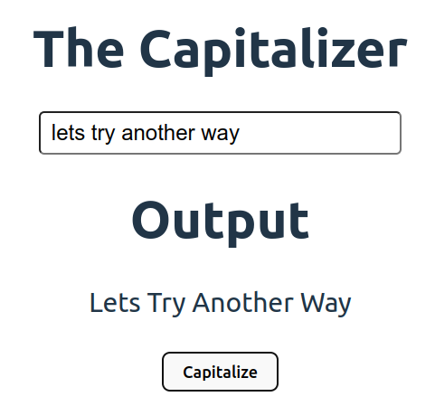

# Capitalizor

This app will take a string and capitalize the first letter of each word in a sentence. The main focus of this project is to practice the logic behind the app using javascript.

## MVP

To consider this project complete, I need to accomplish the following:

- Must have an input field to take user input
- A button to perform the function
- Basic CSS styling to make it presentable
- Fully functional logic

## Project Reflection

I can improve this project by doing following: 

- I can chain built-in js string methods to make the code concise and I can avoid using temporary variables. 
- I can use .trim() on any string to trim out white spaces from the start and end of the string.
- I can use substring(start, end) to get string excluding a part of the string.

## ScreenShots

